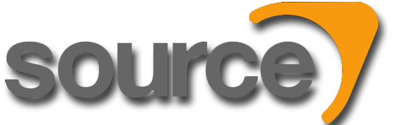

RedSource 
==========================
RedSource  is open source version of the Source engine, used in  Half life 2 , Counter-Strike Source ,Garry's Mod, etc. games series by Valve.

### Supported Platform
|Platform|Configurations|Status|
|---|---|---|
|Windows|Debug / Release (x86)||

### Supported Games
|Game|Support|
|---|---|
|Half-life 2|Yes|
|half-life 2 episode one|Planned|
|Counter-Strike Source|Planned|
### More details
This repository contains Source Engine sources based on version 2007.

It is a place to share ideas on what to implement, gather people that want to work on the engine,
and work on the source code.

If you find a bug or have an enhancement request, file an [Issue](https://github.com/TheBearProject/RedSource/issues).

Pull requests appreciated! However, the following things should be taken into consideration:
* We want to keep the game as close as possible to the vanilla game, so instead of introducing new gameplay features,
  consider adding non-gameplay features, fixing bugs, improving performance and code quality
* Major changes should be discussed before implementation

Be advised that this project is not sanctioned by Valve in any way – and they remain the copyright holders
of all the original source code.
